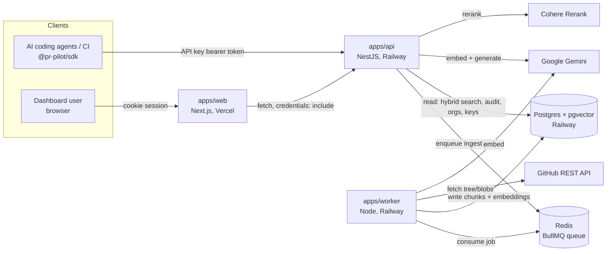
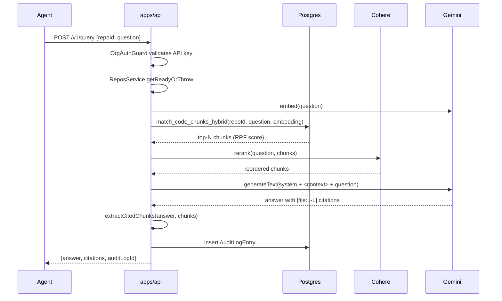
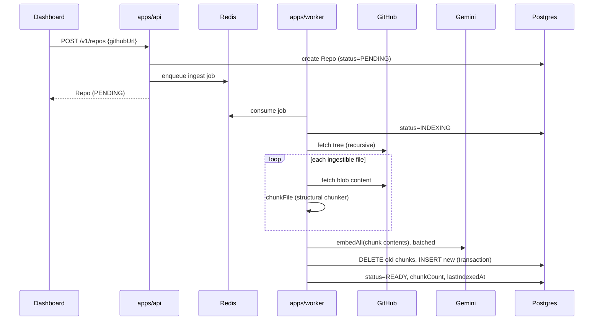

# System Architecture

## 1. Overview

Three deployable services, one shared database, one shared job queue:



## 2. Services

| Service | Tech | Responsibility | Deploys to |
|---|---|---|---|
| `apps/web` | Next.js 14 (App Router) | Dashboard: auth forms, repo/API-key management, playground, audit log viewer | Vercel |
| `apps/api` | NestJS | Auth, orgs, API keys, repos, query, impact analysis, audit log, rate limiting | Railway |
| `apps/worker` | Node + BullMQ | Repo ingestion: fetch, chunk, embed, persist | Railway |

Shared packages: `@pr-pilot/types` (DTOs), `@pr-pilot/db` (Prisma schema + client),
`@pr-pilot/ui` (React components), `@pr-pilot/sdk` (agent/CI client), `@pr-pilot/config`
(shared tsconfig/eslint/tailwind).

## 3. Request flow — grounded query



## 4. Ingestion flow



## 5. Layering within `apps/api`

```
Controller  (HTTP boundary: DTO validation, guards)
   -> Service  (orchestration, business rules)
      -> Retrieval services (embedding, hybrid search, rerank, generation)
      -> PrismaService (data access)
```

- **Controllers** never contain business logic — they validate input (class-validator
  DTOs), delegate to a service, and return its result.
- **Guards** (`OrgAuthGuard`, `RolesGuard`) run before the controller method and attach
  a normalized `OrgContext` — every downstream layer trusts `orgId` came from a verified
  credential, never from a request body.
- **Retrieval services** (`EmbeddingService`, `HybridSearchService`, `RerankService`,
  `GenerationService`) are single-responsibility and independently unit-tested; `
  QueryService`/`ImpactService` compose them.

## 6. Data flow ownership (single source of truth)

- **Schema**: owned by `packages/db/prisma/schema.prisma`. Neither app defines its own.
- **Chunk embeddings**: written only by the worker, read only by the API. Never
  written by the API.
- **Repo status**: written only by the worker (`PENDING → INDEXING → READY/FAILED`),
  except the initial `PENDING` row created by the API on registration.
- **Audit log**: written only by `AuditService`, called from `QueryService`/
  `ImpactService` — never written directly by a controller.

## 7. Security boundaries

- Every data-access query in `apps/api` is scoped by `orgId` from the verified
  `OrgContext` — see `ReposService.getById`, `AuditService.list`, etc. There is no
  endpoint that accepts an org ID from the request body/params for authorization
  purposes.
- Retrieved code content and diffs are treated as untrusted data when passed to the
  LLM: system prompts explicitly instruct the model to treat `<context>`/`<candidates>`
  blocks as data, not instructions (see `generation.service.ts`,
  `impact-generation.service.ts`) — a prompt-injection mitigation.
- Model-reported impact-analysis chunks are cross-checked against the actual retrieved
  candidate set before being returned; anything the model invented is dropped.

## 8. Scaling notes

- **API**: stateless, horizontally scalable behind Railway's load balancing.
- **Worker**: BullMQ concurrency is per-process (`CONCURRENCY = 2`); scale by running
  more worker replicas, not by raising concurrency unboundedly (GitHub/embedding API
  rate limits are the real ceiling).
- **Postgres**: the `code_chunks` table is the only one that grows unbounded with
  usage; `hnsw` (vector) and `gin` (full-text) indexes keep both search paths
  logarithmic-ish in practice rather than full scans. Partitioning by `repo_id` is the
  documented next step if a single Postgres instance becomes the bottleneck.
