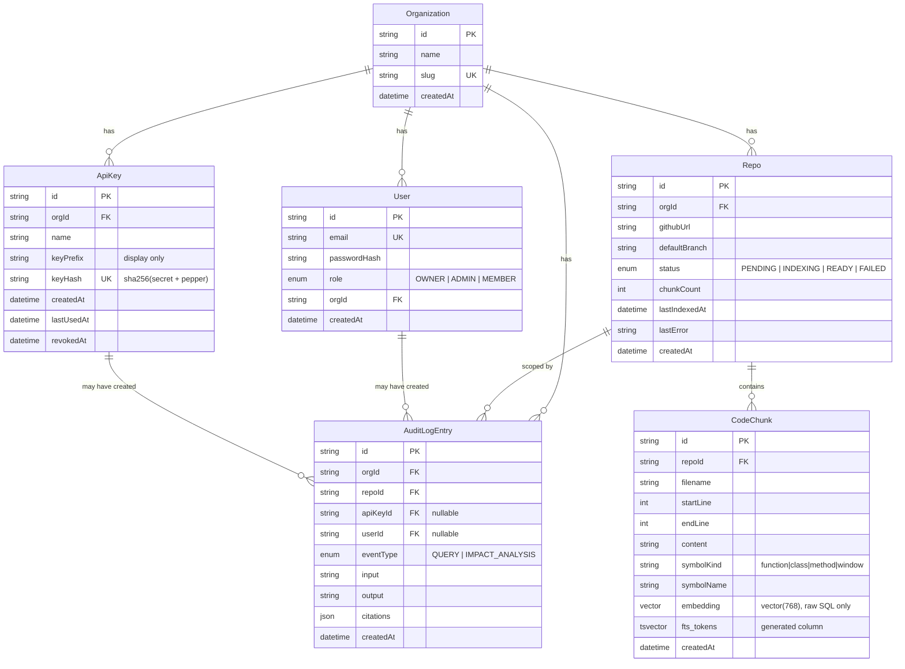

# ERD / Data Model

Source of truth: `packages/db/prisma/schema.prisma`. This doc is a human-readable view.

## Notes

- All primary keys are `cuid()` strings, not database-native UUIDs — no `uuid`
  extension dependency, and IDs are generated in application code (Prisma) except for
  `CodeChunk` rows, which the worker inserts via raw SQL and IDs with
  `crypto.randomUUID()` (see `apps/worker/src/ingest/persist-chunks.ts`) since that path
  bypasses Prisma's normal `create()`.
- `Repo.githubUrl` is unique **per org** (`@@unique([orgId, githubUrl])`), not globally
  — two different orgs can both index the same public repo independently.
- `AuditLogEntry.apiKeyId` and `.userId` are both nullable and mutually informative:
  exactly one is set per row, indicating whether the action was taken by a dashboard
  user or an agent/CI API key. Both use `onDelete: SetNull` so deleting a user or
  revoking a key never deletes its audit history.
- `CodeChunk.embedding` and `.fts_tokens` are the only columns not managed through
  Prisma Client's normal query API — see ADR 0003.
- Indexes: `hnsw` on `embedding` (approximate vector search), `gin` on `fts_tokens`
  (full-text), plus standard btree indexes on every foreign key and on
  `AuditLogEntry(orgId, createdAt)` for the paginated audit log query.
