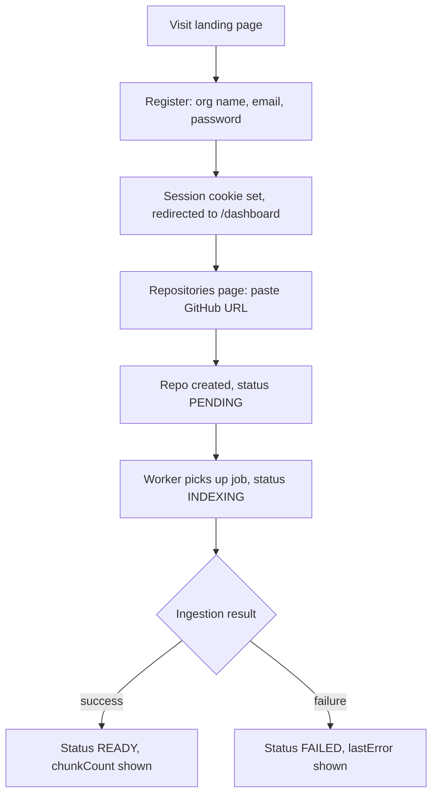
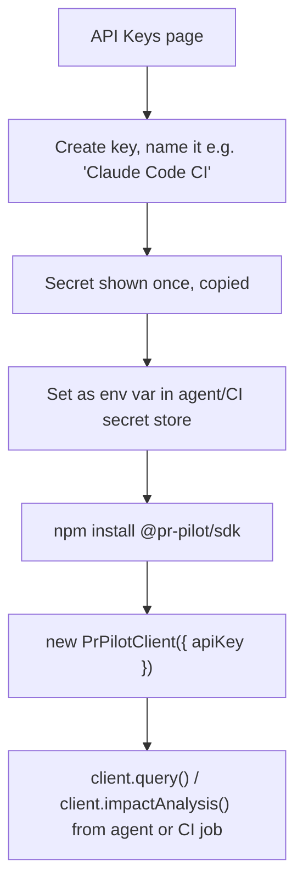
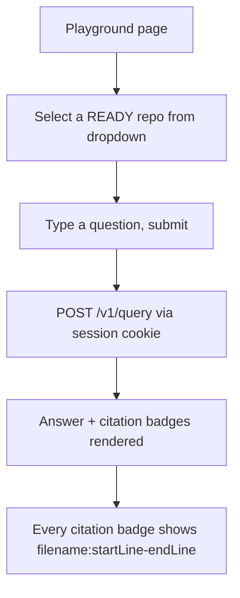
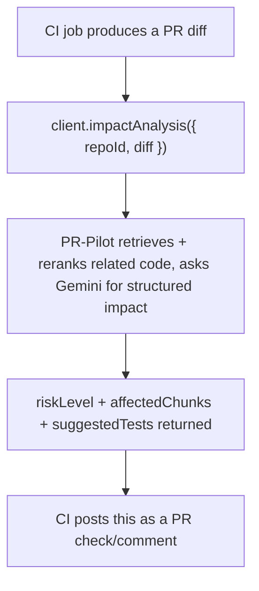
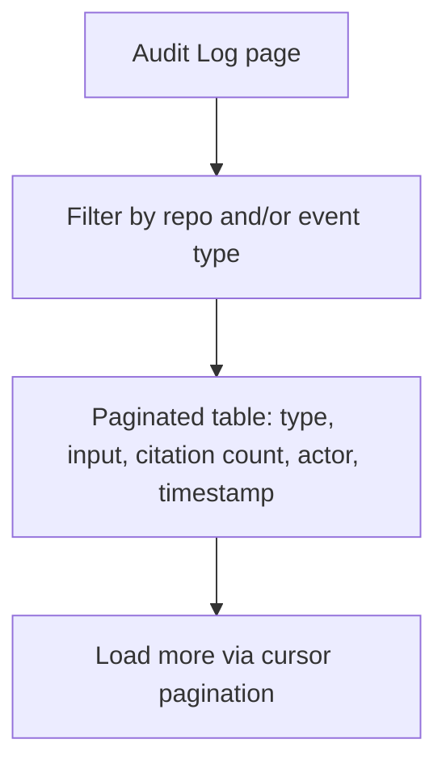

# User Flows & Page Descriptions

## Flow 1 — Sign up and index a repo

The Repositories page polls every 5s while any repo is `PENDING`/`INDEXING`, so the
user watches status update live without a manual refresh.

## Flow 2 — Wire an AI agent/CI pipeline to PR-Pilot

## Flow 3 — Ask a grounded question (Playground)

## Flow 4 — Pre-merge impact analysis gate (agent/CI, not dashboard)

## Flow 5 — Governance review

---

## Page-level descriptions

### `/` — Landing
Single page: headline, one-paragraph pitch, three feature callouts (grounded
retrieval, impact analysis, governance audit trail), CTAs to `/register` and `/login`.

### `/login`, `/register`
Centered single-card form. Register additionally collects an org name. Both redirect to
`/dashboard` on success; errors render inline below the form, not as a toast.

### `/dashboard` (Overview)
Sidebar + top bar shell (shared by all `/dashboard/*` pages). Overview card shows org
name/slug/created date, plus a short "what to do next" pointer to Repos → API Keys →
Playground.

### `/dashboard/repos`
A form (GitHub URL input + submit) above a table (repo URL, status badge, chunk count,
last indexed). Empty state prompts registering the first repo.

### `/dashboard/api-keys`
A form (key name + submit) above a table (name, key prefix, active/revoked badge, last
used, revoke action). Immediately after creation, the full secret is shown once in a
highlighted callout with a "copy now, won't be shown again" warning, then replaced by
the normal create form.

### `/dashboard/playground`
Repo selector + question textarea + submit. Below: the answer text and a row of
citation badges (`filename:start-end`). Empty state (no `READY` repos yet) explains why
and points back to Repos.

### `/dashboard/audit-log`
Filterable table (type badge, truncated input, citation count, actor — "API key" vs
"Dashboard user", timestamp). "Load more" button appends the next cursor page rather
than replacing the table.

## Edge-case UI states covered

- Loading state ("Loading…") for every data-fetching page before its first response.
- Empty state (`EmptyState` component) for zero repos, zero API keys, zero `READY`
  repos in the Playground, and zero audit log entries.
- Inline error text (not a toast/modal) under every form on submission failure, sourced
  from the API's actual error message.
